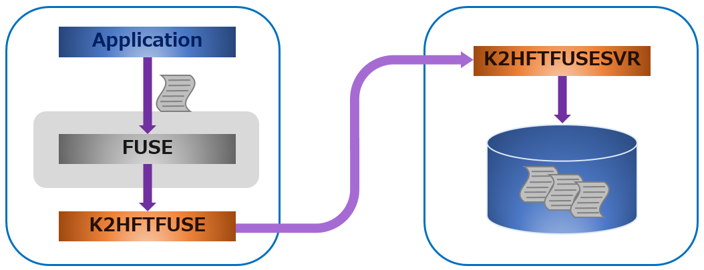

# K2HFTFUSE
**K2HFTFUSE** (**F**ile **T**ransaction by **FUSE** based file system) is a system that realizes safe and fast files and messages transfer at low cost.

K2HFTFUSE is a virtual file system based on [FUSE（Filesystem in Userspace）](https://github.com/libfuse/libfuse), which enables fast files and messages transfer.  
You can transfer files and messages simply by only writing the file to the virtual file system provided by K2HFTFUSE.  
Just output files and messages to the file which is in mounting point by K2HFTFUSE without changing the existing program, you can transfer them.  
For example, you do not change the existing program at all, and log file aggregation can be fast and safe.

There is [fluentd](http://www.fluentd.org/) as a system(program) similar to the function of K2HFTFUSE.  
K2HFTFUSE is a system that can perform transfer at high speed and safely even compared with fluentd.

K2HFTFUSE transfers this data when writing data for one line as a text file.  
In addition to this, you can transfer not only text but also binary data and messages.  
And K2HFTFUSE can perform filtering and specified processing on the data to be transferred.

## Background
In addition to web services, it is necessary to aggregate log files and data etc. as usual.  
To aggregate large logs, use a system built with [Kafka](https://kafka.apache.org/) + [Storm](http://storm.apache.org/), or use a system built with fluentd on a small scale.  
K2HFTFUSE was developed to transfer data that is as simple as fluentd and fast and safe like Kafka + Storm, using the same product library/system([FULLOCK](https://fullock.antpick.ax/), [K2HASH](https://k2hash.antpick.ax/), [CHMPX](https://chmpx.antpick.ax/), [K2HTPDTOR](https://k2htp_dtor.antpick.ax/)).  
K2HFTFUSE is based on libfuse(FUSE) and using a library/system of our product, it became a system with high performance, availability and scalability.

## Overview
The figure below shows data(files and messages) transfer using K2HFTFUSE.

K2HFTFUSE system is a FUSE derived program using libfuse (FUSE).  
The data (files/messages) transferred by the K2HFTFUSE program can be received by the K2HFTFUSESVR program and can be aggregated at the transfer destination.  
If the data to be transferred is text(log file, etc), transfer is performed on a line-by-line basis.

By using FUSE, it is unnecessary to change the program of the transfer source, and transfer can be done just by mounting the directory of the output file (log file) by FUSE.  
Therefore, there are no barriers to introduction into existing systems, and it can be introduced easily like fluentd.

K2HFTFUSE can freely configure multiple transfer sources and multiple transfer destinations.  
You can also aggregate data(files/messages) from multiple sources into one source server.  
And you can prepare multiple transfer destination servers, distribute transfer, or multicast forwarding.  
This communication control is a function realized by our product system(CHMPX).

"K2H" of the prefix of the name of K2HFTFUSE means K2HASH.  
K2HASH is the KVS (NoSQL) library provided by our product.  
K2HFTFUSE is a system using K2HASH.

By using the K2HASH library, K2HFTFUSE can provide queuing of data(files/messages) to be transferred.  
Then when transfer delay occurs due to communication disconnection or high load of the transfer destination server, transfer data is queued and establishment to lost is low.
