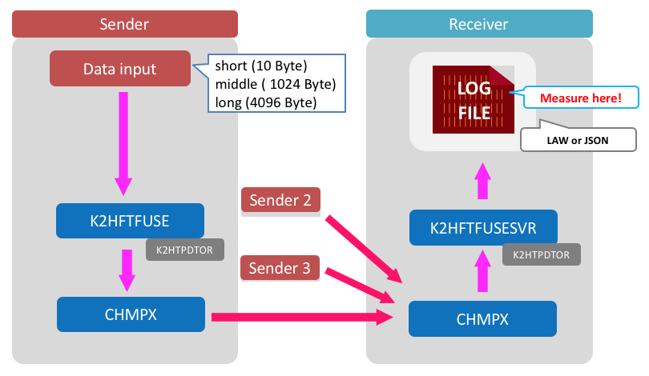
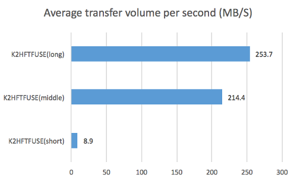
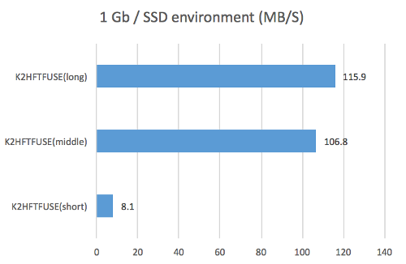
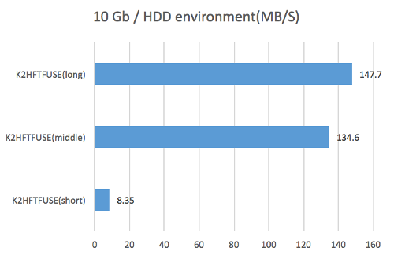
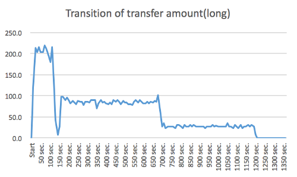
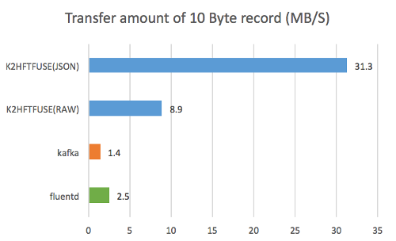
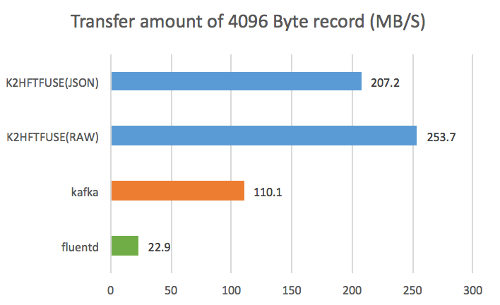

# The performance measurement result of K2HFTFUSE
<!-- ---------------------------------------------------------------------------------- -->
<!-- ---------------------------------------------------------------------------------- -->
<!-- ---------------------------------------------------------------------------------- -->

----

## Contents
  
### [Performance measurement result](#result001)
- [Performance result (no bottleneck environment)](#result001)
- [Measurement in 1 Gbps network (network bottleneck environment)](#result002)
- [Measurement in HDD use environment (bottleneck environment of file / device)](#result003)

### [Comparison with other products Measurement results](#resultothers)
- [Performance measurement result](#result004)

### [Summary](#summary)
- [On the performance of K2HFTFUSE](#summary01)
- [Effective use case with K2HFTFUSE](#summary03)
- [in conclusion](#summary04)
  
### [Appendix](#appendix00)
- [About determining how to measure](#pretest)
- [Measurement script](#appendix02)
- [K2HFTFUSE setting file (receiving side)](#appendix03)
- [K2HFTFUSE setting file (sending side)](#appendix04)

----
<!-- ---------------------------------------------------------------------------------- -->
<!-- ---------------------------------------------------------------------------------- -->
<!-- ---------------------------------------------------------------------------------- -->
## <a name="result">Performance measurement result</a>

### <a name="result001">Performance result (no bottleneck environment)</a>
Transfer amount was measured in an environment without hardware bottleneck.
We used 10 Gbps network and SSD.

#### Measured content
We prepared three patterns of data files.

- long: 4096 Bytes x 10 million records / middle: 1024 bytes x 10 million records / short: 10 bytes x 100 million records  
We will transmit this file from three clients to one server and measure the amount of data transfer.  
  



#### Hardware used
- Xeon E7-4850 / 4CPU
- 128GB MEM
- SAS 300GB x2 / RAID1 x 1 vol
- Network 10 Gbps  
  
#### Environment used
- OS is ubuntu 14.04.  
- We prepared a network environment at 10 Gbps.  
- K2HFTFUSE is using OSS version 1.0.23.  
  
#### Measuring method
- Start transmission from 3 slaves at the same time. (It is not completely simultaneous as it is manual.)  
- The receiving server aggregates the received data into one file. It checks the file size every 10 seconds. Calculate the transfer amount from this difference.  
- Take the average value for 100 seconds from the point when the transmission volume from about 20 seconds has stabilized, and take the average value obtained three times.  

#### Data input method  
- With this command, We threw it. ```cat [Data file] > [Transfer target directory]```

#### Data aggregation method
- Aggregated into one file by specifying ```[K2HFTFUSESVR]FILE_UNIFY``` in the configuration file.

#### Performance measurement result

  
  
The maximum transfer volume is 250 MB. (When sending 4096 Byte record)
  

|Record length | Average Transferred Records (Seconds) | Average transfer bytes (seconds)  |
|           --:|                                    --:|                                --:|
|       10 Byte|                              937,779  |                           8.9 MB/S|
|    1024 Byte |                              219,578  |                         214.4 MB/S|
|    4096 Byte |                              64,943   |                         253.7 MB/S|
  
----
<!-- ---------------------------------------------------------------------------------- -->

### <a name="result002">Measurement in 1 Gbps network (network bottleneck environment)</a>

This is the result when the test aimed at measuring the transfer amount is carried out in 1 Gbps network as above.
This result behaves when network performance is insufficient.

#### Hardware used

- Xeon D-1541 2.1 GHz 8 cores, 16 threads  
- 32 GB MEM  
- SATA SSD 400 GB x 1 / without RAID  
- Network 1 Gbps  

#### Measuring method

For the measurement of the transfer amount, we calculated the number by counting the number of lines of the file aggregated every 10 seconds.
When the measurement is over, the file is deleted, and the next data is written to the re-created file.

#### Performance measurement result

  
  
The transfer amount was the maximum at about 100 MB and the difference was not seen much between the long size and the middle size.
  
As a result of checking with the monitoring tool, we were confirmed that the upper limit of the line speed has actually reached. Therefore, in this measurement, we can see the behavior at the upper limit of the network, but the original performance can not be measured.

#### Summary

- If you use the K2HFTFUSE at 1Gbps network, you need to keep in mind the transfer capacity of more than the limit of the network.
   We think that this can be adjusted by appropriate weighting and transmission frequency.

----
<!-- ---------------------------------------------------------------------------------- -->

### <a name="result003">Measurement in HDD use environment (bottleneck environment of file / device)</a>

As in the above case, it is the result when the test aiming at the transfer amount measurement was carried out by HDD, not SSD.
This result behaves when the performance of the file device is insufficient.

#### Hardware used

- Xeon E5-2630L 2.00GHz / 2CPU  
- 64GB MEM  
- SAS 300GB x2 / RAID1 x 1 vol
- Network 10 Gbps  

#### Measuring method

We checked the file size every 10 seconds and calculated the transfer amount from the difference from the size before 10 seconds ago.

#### Performance measurement result

  
  
The transfer amount became the maximum at around 150 MB, and the difference between the long size and the middle size was not seen much.
There was a phenomenon that the performance suddenly decreased when further transfer was continued after measurement. So, the graph below shows the transition to completion of transfer.

  

We had become obvious by using the monitoring tool at the same time with the measurement.
Free memory was allocated to the cache and gradually decreased, and it was late when it was exhausted.
At the time of this graph, the fastest speed did not come out around 150 seconds, and in the vicinity of 700 seconds, the free memory was almost gone.
  
Since this measurement uses HDD instead of SSD, it can be imagined that the speed of the disk can not keep up with writing data and eventually exhausted memory.
We changed the output destination to /dev/null and looked at the usage status of the network bandwidth, the transition did not slow down halfway through the transfer. For this reason We could confirm that the HDD is a bottleneck.
  
#### Summary
- If the transfer volume exceeds the disk write speed, the performance will degrade after running out of memory.
- When using K2HFTFUSE in the HDD, it is necessary to operate with conscious of the writing speed (transfer amount). When it reaches the upper limit, there is an influence on the performance of the whole OS.

----
<!-- ---------------------------------------------------------------------------------- -->
<!-- ---------------------------------------------------------------------------------- -->
<!-- ---------------------------------------------------------------------------------- -->
## <a name="resultothers">Comparison with other products Measurement results</a>

We tried to compare with fluentd and kafka how to use other products in the same use case.  
This is the product and version which measured the performance this time.
- fluentd 0.14.15
- kafka 2.10-0.10.2.0
- K2HFTFUSE 1.0.23

#### Data input method  
- fluentd  
  With this command, We threw it. ```cat [Data file] > [Transfer target file]```
- kafka  
  Create topic of 1 partition and With this command, We threw it.  ```cat [Data file] | kafka-console-producer.sh```
  Since timeout frequently occurred as it is, ```--request - timeout - ms``` is adjusted while watching the contents of the message.
- K2HFTFUSE  
  With this command, We threw it.  ```cat [Data file] > [Transfer target directory]```
  
#### Data aggregation method
- fluentd  
  By setting ```type file``` in the configuration file, the file is automatically rotated and a symbolic link to the latest file is created.
  Since it is difficult to measure under the same conditions as other products as it is, it redirects the screen output as ```type stdout``` to the file and aggregates it into one file.
- kafka  
  We redirected ```kafka-console-consumer.sh``` output to a file and used it.
- K2HFTFUSE  
  We have summarized it into one file by specifying ``` [K2HFTFUSESVR] FILE_UNIFY``` in the configuration file.
  In addition to the normal raw log output, we also measured the result of JSON output according to fluentd.

#### <a name="result004">Performance measurement result</a>


----
10 Byte records    


- K2HFTFUSE (JSON) has the best performance.  
  This is because the JSON format is measured by the size after conversion to JSON at the receiving server. (In case of K2HFTFUSE (JSON) and fluentd measurement)

----
1024 Byte records   


- K2HFTFUSE (RAW) has the best performance.  

----
4096 Byte records


- K2HFTFUSE (RAW) has the best performance.  

----
#### Comparison with other products Measurement results Summary

- In this use case, K2HFTFUSE was the best performance for any size data.
- Compared with 10 Byte records, kafka tended to have better performance for data with larger record size.

----
<!-- ---------------------------------------------------------------------------------- -->
<!-- ---------------------------------------------------------------------------------- -->
<!-- ---------------------------------------------------------------------------------- -->

### <a name="summary">Summary</a>

#### <a name="summary01">On the performance of K2HFTFUSE</a>

The performance of K2HFTFUSE has reached the limit until 10 Gbps network and high-speed storage are prepared.
When using it in the environment below that, the network and disk writing speed reaches the upper limit before the limit of K2HFTFUSE.
Therefore, it can be used effectively without concern about the limit of K2HFTFUSE on the majority of existing systems.

#### <a name="summary03">Effective use case with K2HFTFUSE</a>
This time, we investigated the performance mainly for log transfer which is one of the assumed use cases of K2HFTFUSE.
As a result, we were able to confirm performance beyond our expectation in log transfer.  
  
From this result, We believe the following usage examples are effective.  

- Transfer a log in which a large amount of data is written.  
- Transfer and aggregate logs that are vomited to many files.  
- Process transfer data. (This time trying in JSON format)  
- Easy trial of data processing as a prototype.  

Moreover, We think that there are many scenes that can take advantage of the following features when compared with other products.  
  
- A case where server scale (addition or deletion) is frequently performed after operation.
- Take over to the system operation team with minimal manual.
  

#### <a name="summary04">in conclusion</a>
We compared this with fluentd and kafka which have similar functions as comparison objects, but We are not a professional of these two products.
Therefore, We think that better results will be obtained if you are familiar with these products tuning and measuring.
If there is a result of tuning with the same use case We think that you should publish it by all means.
Also, if there are measurement results in other use cases, We would like to try measurement even with K2HFTFUSE.

  
  
----

## <a name="appendix00">Appendix</a>
  
This is the measurement method and the setting file used for measurement.

----

<!-- ---------------------------------------------------------------------------------- -->
<!-- ---------------------------------------------------------------------------------- -->
<!-- ---------------------------------------------------------------------------------- -->
### <a name="pretest">About determining how to measure</a>
We will briefly introduce preparation and trial and error to the measuring method.

#### Installation
We arranged the development server and our network within our company, installed each product and checked the communication in the tutorial.  
We use fluentd and kafka without tune for speeding up especially.
  
#### Preliminary test
We measured while changing data file and server configuration.
- Send small data on one sender and one receiver  
  We measured the time from the start of transmission to the end of transmission of 100 Byte x 10 million records.
- Change the data size  
  We prepared three records with record number of 100 million and record length of 32/256/1024 bytes.
  Then, we measured the time until the end of writing the file on the receiving side three times, and we got the 
  average value.  
- Try sending from multiple units  
  Let's increase the number of sending side to 2, 3 by using data of record length 32 bytes.  
  
Based on this result, we examined the measurement method and data size when testing in a dedicated environment.

- Test data length  
Until now We measured it with a maximum of 1024 bytes, but We thought that preparing a larger size would be an indicator for many cases and decided to make the maximum length 4096 bytes in the actual measurement.  
- Measuring method  
  We decided to count the number of lines every 10 seconds and delete the file and calculate the theoretical value.
  This is because we want to measure the pure transfer capability by removing the influence of the sender.  
- Measurement section  
  As We tried with each product, it took about 20 seconds to get the speed steadily from the start of transfer, 
  so We decided to set it as the measurement section from here.  

----
<!-- ---------------------------------------------------------------------------------- -->
<!-- ---------------------------------------------------------------------------------- -->
<!-- ---------------------------------------------------------------------------------- -->
### <a name="appendix02">Measurement script</a>

For files aggregated on the server side, the number of bytes to be written was calculated using the following script.

```
#!/bin/bash
pre=0
while :
do
	date=`date`
	now=`ls -l log.txt | awk '{print $5;}'`
	num=`expr $now - $pre`

	echo -n "$date "
	echo $num

	pre=$now
	sleep 10
done
```

----
<!-- ---------------------------------------------------------------------------------- -->
<!-- ---------------------------------------------------------------------------------- -->
<!-- ---------------------------------------------------------------------------------- -->
### <a name="appendix03">K2HFTFUSE setting file (receiving side)</a>
  
This is the setting file used for this measurement.

  
```
# k2hftfuse server side
#
# GLOBAL SECTION
#
[GLOBAL]
FILEVERSION			= 1
DATE				= Thu, 03 Sep 2015 17:27:28 +0900
GROUP				= K2HFUSETEST
MODE				= SERVER
DELIVERMODE			= random
MAXCHMPX			= 5
REPLICA				= 0
MAXMQSERVER			= 64
MAXMQCLIENT			= 64
MQPERATTACH			= 1
MAXQPERSERVERMQ			= 2
MAXQPERCLIENTMQ			= 32
MAXMQPERCLIENT			= 8
MAXHISTLOG			= 0
PORT				= 8020
CTLPORT				= 8021
SELFCTLPORT			= 8021
RWTIMEOUT			= 10000
RETRYCNT			= 1000
CONTIMEOUT			= 500000
MQRWTIMEOUT			= 20000
MQRETRYCNT			= 2000
MQACK				= no
DOMERGE				= on
AUTOMERGE			= on
MERGETIMEOUT			= 0
SOCKTHREADCNT			= 8
MQTHREADCNT			= 4
MAXSOCKPOOL			= 8
SOCKPOOLTIMEOUT			= 0
SSL				= no
K2HFULLMAP			= on
K2HMASKBIT			= 8
K2HCMASKBIT			= 7
K2HMAXELE			= 32
K2HPAGESIZE			= 5000

#
# SERVER NODES SECTION
#
[SVRNODE]
NAME				= xxxx.yahoo.co.jp
SSL				= no

#
# SLAVE NODES SECTION
#
[SLVNODE]
NAME				= [.]*
CTLPORT				= 8022

[K2HFTFUSESVR]
TYPE				= file
FILE_BASEDIR			= /tmp/k2hftfusesvr
FILE_TIMEFORM			= "%F %T.%-"
#FORMAT				= "%T +0900 temotest': {'message':'%l','host':'%H'}\n" # for JSON format
FORMAT				= "%L"
FILE_UNIFY			= log/unify.log

#
# VIM modelines
#
# vim:set ts=4 fenc=utf-8:
#
```
----
<!-- ---------------------------------------------------------------------------------- -->
<!-- ---------------------------------------------------------------------------------- -->
<!-- ---------------------------------------------------------------------------------- -->
### <a name="appendix04">K2HFTFUSE setting file (sending side)</a>
  
This is the setting file used for this measurement. 

  
```
# k2hftfuse slave side
#
# GLOBAL SECTION
#
[GLOBAL]
FILEVERSION			= 1
DATE				= Thu, 03 Sep 2015 17:27:28 +0900
GROUP				= K2HFUSETEST
MODE				= SLAVE
DELIVERMODE			= random
MAXCHMPX			= 5
REPLICA				= 0
MAXMQSERVER			= 64
MAXMQCLIENT			= 32
MQPERATTACH			= 8
MAXQPERSERVERMQ			= 16
MAXQPERCLIENTMQ			= 1
MAXMQPERCLIENT			= 8
MAXHISTLOG			= 1000
PORT				= 8020
CTLPORT				= 8022
SELFCTLPORT			= 8022
RWTIMEOUT			= 100000
RETRYCNT			= 10000
MQRWTIMEOUT			= 50
MQRETRYCNT			= 20000
CONTIMEOUT			= 500000
MQACK				= no
DOMERGE				= on
AUTOMERGE			= on
MERGETIMEOUT			= 0
SOCKTHREADCNT			= 0
MQTHREADCNT			= 8
MAXSOCKPOOL			= 8
SOCKPOOLTIMEOUT			= 0
SSL				= no
K2HFULLMAP			= on
K2HMASKBIT			= 8
K2HCMASKBIT			= 4
K2HMAXELE			= 32

#
# SERVER NODES SECTION
#
[SVRNODE]
NAME				= xxxx.yahoo.co.jp
PORT				= 8020
CTLPORT				= 8021
SSL				= no

#
# SLAVE NODES SECTION
#
[SLVNODE]
NAME				= [.]*
CTLPORT				= 8022

#
# K2HTPDTOR
#
[K2HTPDTOR]
K2HTPDTOR_BROADCAST		= no
K2HTPDTOR_FILTER_TYPE		= DELKEY

[K2HFTFUSE]
K2HTYPE				= mem
K2HMASKBIT			= 8
K2HCMASKBIT			= 4
K2HMAXELE			= 32
K2HPAGESIZE			= 4096
DTORTHREADCNT			= 2
BINTRANS			= no
TRANSLINECNT			= 10000
TRANSTIMEUP			= 10
BYTELIMIT			= 0

#
# K2HFTFUSE_RULE_DIR( K2HFTFUSE sub rule )
#

[K2HFTFUSE_RULE_DIR]
TARGET          = senddir
TRUNS           = on
DEFAULTALL      = ALLOW

#
# VIM modelines
#
# vim:set ts=4 fenc=utf-8:
#
```
